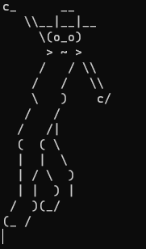
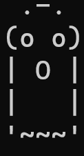
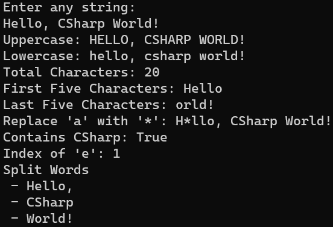
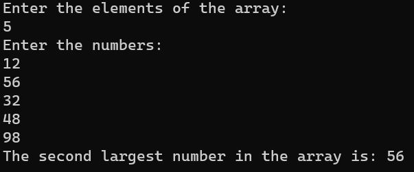
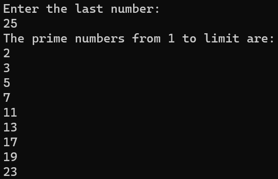
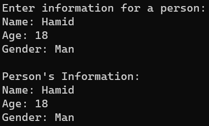
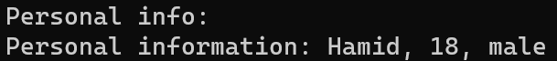
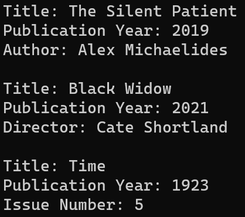

# console_app_csharp

1. Simple creature

2.Holmes creature

3. Average Score

4. Temperature (Celcius To Fahrenheit)

5. Conversion Task

6. Parse 

7. Calculation 1

8. Arithmetic task

9. Condition If-Else 

10. Arithmetic Operators

11. Condition Switch-Case

12. Calculate Even Product

13. Factorial

14. Ternary Operator

15. Odd Numbers

16. Reverse Function 

17. Swapping Number

18. Student System

19. Array 

20. 2*2 array

21. Average Array

22. Max_Min Value Array

23. String Operators

24. Find the second largest number in Array

25. Prime Numbers

26. Basic Class

27. Personal Information

28. Polymorphism

29. Library Polymorphism

